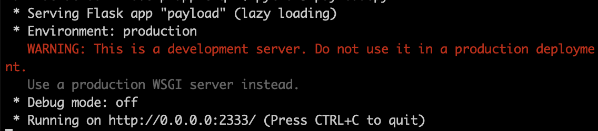

## SpringBoot 1.x /env enreka RCE

### Description
When the application use others like undertow instead of embeded tomcat, the RCE with jolokia not work well. So RCE with enreka by modifying the endpoint /env is a valid way.

### EXP
1. put the ```payload.py``` in your VPS and run it. 



2. ```nc -lvp port```

3. Run the ```exp.py``` twice.


